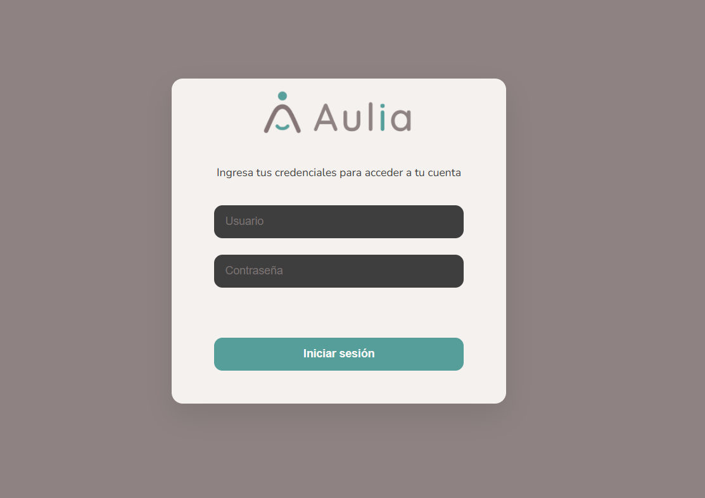

# Convenciones del Manual

[Volver al indice](./index.md)

## Botones

- **Guardar** confirma y registra la informacion ingresada.
- **Cancelar** descarta el formulario actual y vuelve a la pantalla anterior.
- **Volver** regresa al listado o pantalla previa del modulo.
- **Editar** abre el formulario de modificacion del registro seleccionado.
- **Ver detalle** abre una pantalla de solo lectura con la informacion del registro.
- Las opciones deshabilitadas indican funcionalidades no disponibles en esta etapa.

## Tablas

En las pantallas con tabla, primero se selecciona un registro desde la columna de seleccion o desde la accion disponible. Luego se habilitan las acciones relacionadas.

## Formularios

Los campos obligatorios deben completarse antes de guardar. Si falta informacion, el sistema muestra un mensaje indicando que datos completar.

## Mensajes

- Los mensajes de error aparecen dentro de la pantalla del modulo.
- Si el backend no esta disponible, el sistema muestra un mensaje de conexion.
- Si la sesion no existe o no es valida, el sistema redirige al login.

## Capturas

Cuando se agreguen capturas, usar nombres claros y estables. Ejemplo:

```md

```

Siguiente: [Acceso y cierre de sesion](./01-acceso-sesion.md)
