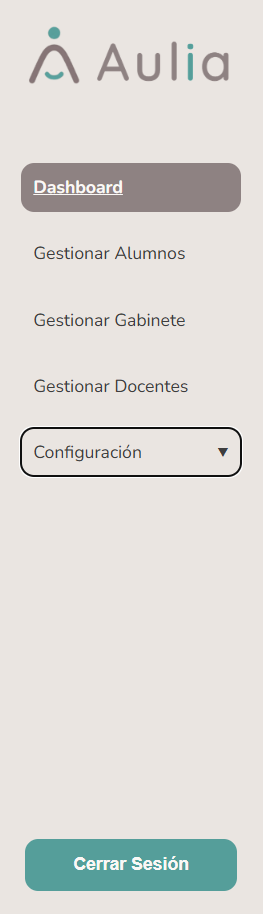

# Navegacion General

[Volver al indice](./index.md)

## Menu lateral

El menu lateral muestra las opciones disponibles para el rol logueado. Las opciones pueden variar entre Administrador, Docente, Gabinete, Alumno y Directivo.

Algunas opciones pueden aparecer deshabilitadas cuando corresponden a funcionalidades fuera del alcance del MVP. En ese caso, no permiten navegar ni operar el modulo.

## Encabezado

En la parte superior se muestra el rol activo y la informacion basica del usuario.

## Acciones comunes

1. Usar el menu lateral para cambiar de modulo.
2. Usar los botones de la barra superior de cada pantalla para crear, volver o editar.
3. Usar buscadores y filtros cuando esten disponibles.
4. Revisar los mensajes de error si una accion no se completa.
5. Si una opcion aparece deshabilitada, considerar que no esta disponible en esta etapa.

## Navegacion por rol

- [Administrador](./admin/index.md)
- [Docente](./docente/index.md)
- [Gabinete](./gabinete/index.md)
- [Alumno](./alumno/index.md)
- [Directivo](./directivo/index.md)

Anterior: [Acceso y cierre de sesion](./01-acceso-sesion.md)  
Siguiente: [Panel Administrador](./admin/index.md)
