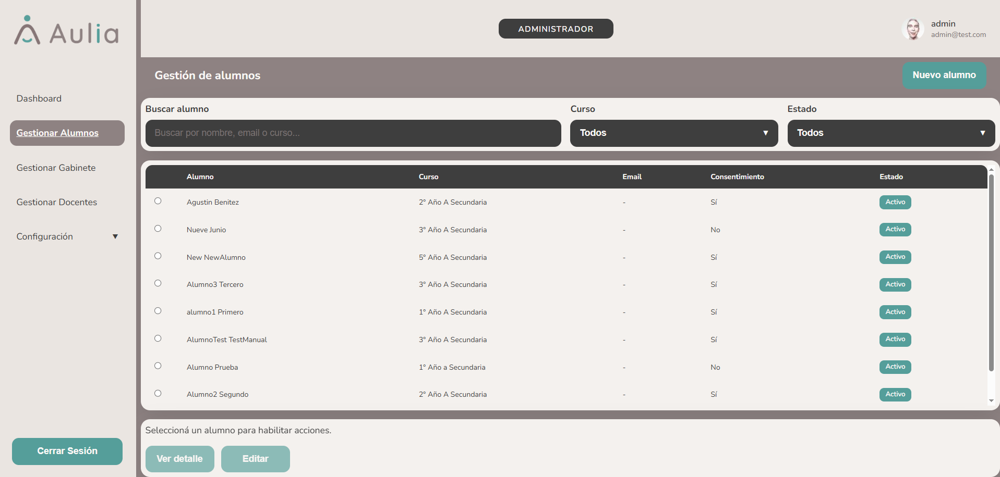
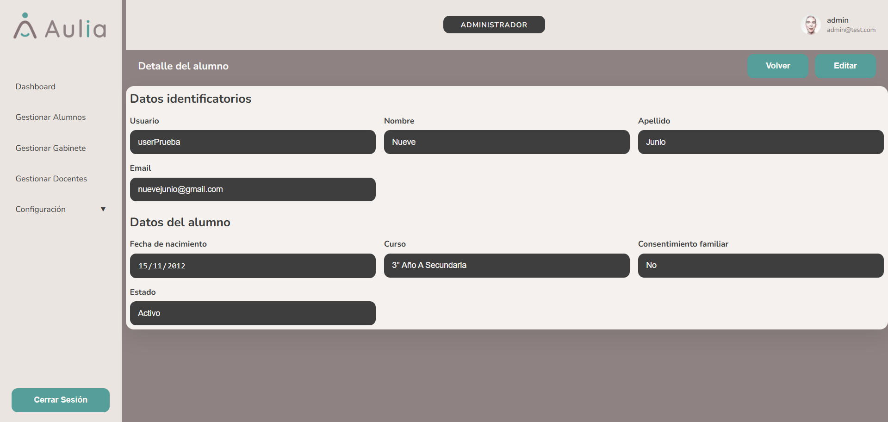
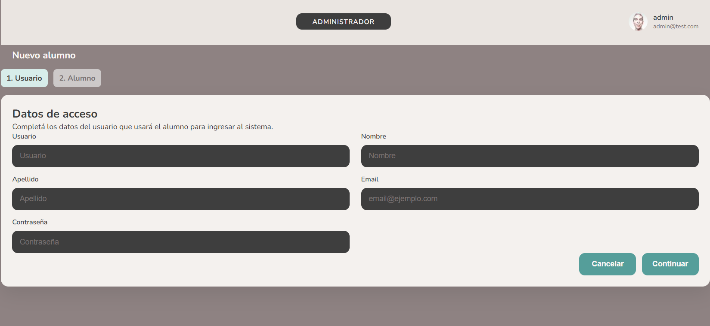
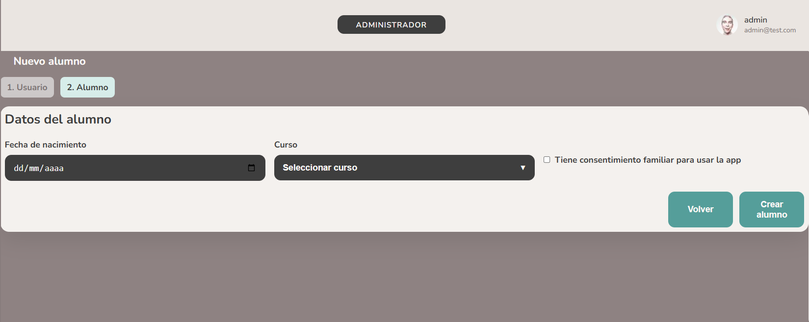

# Administrador - Gestionar Alumnos

[Volver a Administrador](./index.md) | [Volver al indice](../index.md)

## Listar alumnos

1. Ingresar a **Gestionar Alumnos**.
2. Revisar la tabla de alumnos.
3. Usar el buscador para filtrar por datos visibles.

## Ver detalle de alumno

1. En el listado, seleccionar el alumno.
2. Presionar **Ver detalle**.
3. Revisar datos identificatorios y escolares.
4. Presionar **Volver** para regresar al listado.

## Crear alumno

1. Ingresar a **Gestionar Alumnos**.
2. Presionar **Nuevo alumno**.
3. Completar los datos de acceso:
   - Usuario.
   - Nombre.
   - Apellido.
   - Email.
   - Contrasena.
4. Continuar al paso de datos escolares.

5. Completar:
   - Fecha de nacimiento.
   - Curso.
   - Consentimiento familiar, si corresponde.
6. Presionar **Guardar**.

El sistema guarda usuario y alumno como una sola operacion. Si ocurre un error, no debe quedar un alumno creado parcialmente.

## Editar alumno

1. En el listado, seleccionar el alumno.
2. Presionar **Editar**.
3. Modificar los datos necesarios.
4. Para mantener la contrasena actual, dejar el campo de contrasena vacio.
5. Presionar **Guardar cambios**.

## Cancelar una carga o edicion

1. Presionar **Cancelar**.
2. El sistema vuelve al listado sin guardar los cambios del formulario actual.

## Validaciones esperadas

- No permite guardar si faltan datos obligatorios.
- Muestra mensaje si ocurre un error de carga o guardado.
- Mantiene los datos escritos mientras se corrige un campo incompleto.

Anterior: [Panel Administrador](./index.md)  
Siguiente: [Gestionar docentes](./docentes.md)
