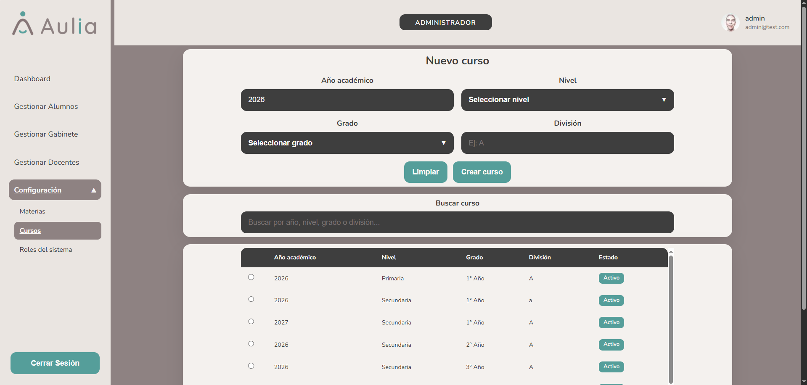

# Administrador - Configurar Cursos

[Volver a Administrador](./index.md) | [Volver al indice](../index.md)

## Listar cursos

1. Ingresar a **Configuracion**.
2. Seleccionar **Cursos**.
3. Revisar los cursos activos.
4. Usar el buscador para filtrar por ano, nivel, grado o division.

## Crear curso

1. Completar:
   - Ano academico.
   - Nivel.
   - Grado.
   - Division.
2. Presionar **Guardar**.

## Limpiar formulario

1. Presionar **Limpiar**.
2. El sistema vacia los campos del formulario.

## Desactivar curso

1. Seleccionar un curso del listado.
2. Presionar **Desactivar**.
3. Confirmar la accion en el modal.
4. El curso deja de figurar como activo.

## Validaciones esperadas

- No permite guardar si faltan ano academico, nivel, grado o division.
- Solicita confirmacion antes de desactivar.

Anterior: [Gestionar gabinete](./gabinete.md)  
Siguiente: [Configurar materias](./configuracion-materias.md)

