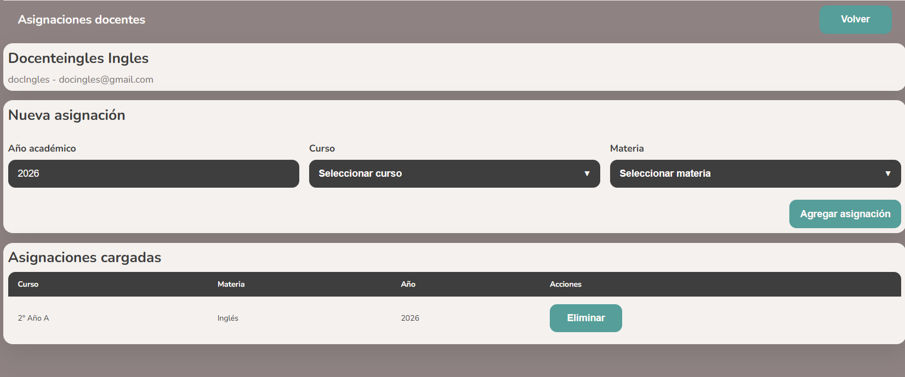

# Administrador - Gestionar Docentes

[Volver a Administrador](./index.md) | [Volver al indice](../index.md)

## Listar docentes

1. Ingresar a **Gestionar Docentes**.
2. Revisar la tabla.
3. Usar el buscador para encontrar docentes por nombre, usuario o email.

## Crear docente

1. Presionar **Nuevo docente**.
2. Completar datos del usuario.
3. Presionar **Guardar**.

## Ver detalle

1. Seleccionar un docente del listado.
2. Presionar **Ver detalle**.
3. Revisar datos del usuario.
4. Desde el detalle se puede ir a **Editar datos** o **Gestionar asignaciones**.

## Editar docente

1. Seleccionar el docente.
2. Presionar **Editar** o ingresar desde el detalle.
3. Modificar los datos necesarios.
4. Si no se desea cambiar la contrasena, dejar el campo vacio.
5. Presionar **Guardar**.

## Gestionar asignaciones docentes

1. Desde el listado o detalle, ingresar a **Gestionar asignaciones**.
2. Seleccionar curso.
3. Seleccionar materia.
4. Guardar la asignacion.

## Eliminar asignacion

1. Seleccionar la asignacion.
2. Presionar la accion de eliminar.
3. Confirmar si el sistema solicita confirmacion.

## Validaciones esperadas

- No permite guardar una asignacion incompleta.
- Muestra error si la asignacion ya existe o si el backend rechaza la operacion.

Anterior: [Gestionar alumnos](./alumnos.md)  
Siguiente: [Gestionar gabinete](./gabinete.md)

