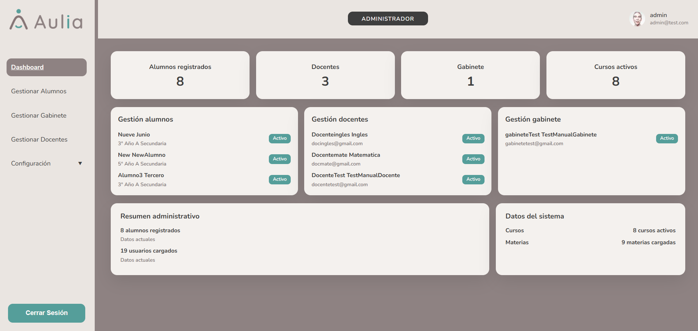

# Panel Administrador

[Volver al indice](../index.md)

El Administrador gestiona la informacion base del sistema: alumnos, docentes, integrantes de gabinete y configuracion institucional.

## Flujos disponibles

- [Gestionar alumnos](./alumnos.md)
- [Gestionar docentes](./docentes.md)
- [Gestionar gabinete](./gabinete.md)
- [Configurar cursos](./configuracion-cursos.md)
- [Configurar materias](./configuracion-materias.md)
- [Consultar roles](./configuracion-roles.md)

## Dashboard

El dashboard muestra indicadores generales y accesos rapidos a modulos principales.

## Buenas practicas

1. Crear primero cursos y materias si van a ser necesarios para asignaciones.
2. Verificar que el usuario tenga email y nombre correctos antes de guardar.
3. En altas de alumno, completar todos los pasos antes de salir de la pantalla.

Anterior: [Navegacion general](../02-navegacion.md)  
Siguiente: [Gestionar alumnos](./alumnos.md)

