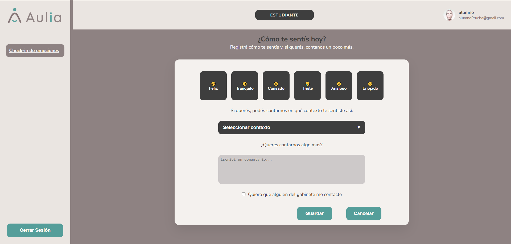

# Panel Alumno

[Volver al indice](../index.md)

El Alumno registra su estado emocional diario mediante un check-in.

## Flujos disponibles

- [Registrar check-in emocional](./check-in.md)

## Dashboard

El dashboard muestra el formulario de check-in emocional.

Anterior: [Agenda y alertas fuera de alcance](../gabinete/agenda-alertas.md)  
Siguiente: [Registrar check-in](./check-in.md)
