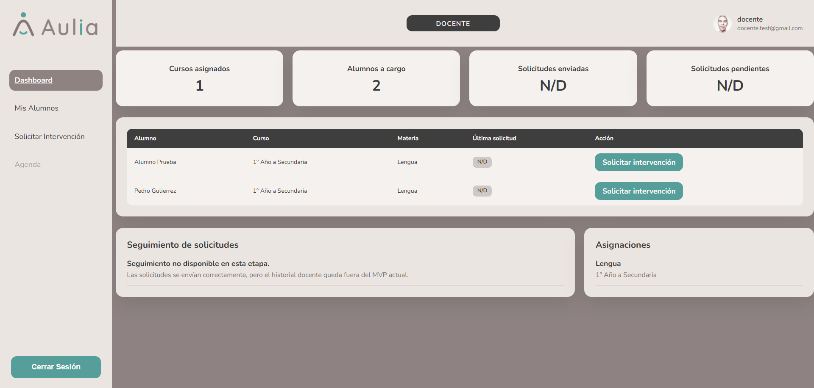

# Panel Docente

[Volver al indice](../index.md)

El Docente consulta sus alumnos asignados y solicita intervenciones al equipo de gabinete.

## Flujos disponibles

- [Mis alumnos](./mis-alumnos.md)
- [Solicitar intervencion](./solicitar-intervencion.md)
- [Agenda docente fuera de alcance](./agenda.md)

## Dashboard

El dashboard muestra informacion resumida del docente, alumnos asignados y solicitudes de intervencion enviadas.

Desde esta pantalla se puede revisar la cantidad de solicitudes enviadas, solicitudes pendientes y la fecha de la ultima solicitud registrada por alumno.

Anterior: [Consultar roles](../admin/configuracion-roles.md)  
Siguiente: [Mis alumnos](./mis-alumnos.md)
