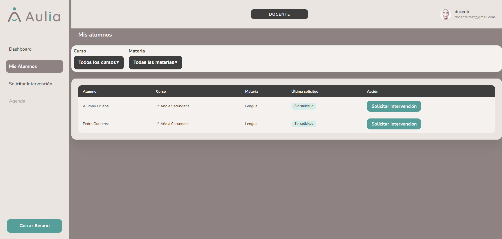

# Docente - Mis Alumnos

[Volver a Docente](./index.md) | [Volver al indice](../index.md)

## Consultar alumnos asignados

1. Ingresar a **Mis alumnos**.
2. Revisar la tabla de alumnos asignados.
3. Usar filtros de curso y materia si estan disponibles.

La columna **Ultima solicitud** muestra la fecha de la ultima solicitud enviada para ese alumno.

Si el alumno no tiene solicitudes registradas, muestra **Sin solicitud**.

## Solicitar intervencion desde un alumno

1. Ubicar el alumno en la tabla.
2. Presionar **Solicitar intervencion**.
3. El sistema abre el formulario con el alumno seleccionado.

## Si no aparecen alumnos

Puede deberse a que el docente no tiene asignaciones cargadas o a que no hay datos disponibles desde el backend.

Anterior: [Panel Docente](./index.md)  
Siguiente: [Solicitar intervencion](./solicitar-intervencion.md)
