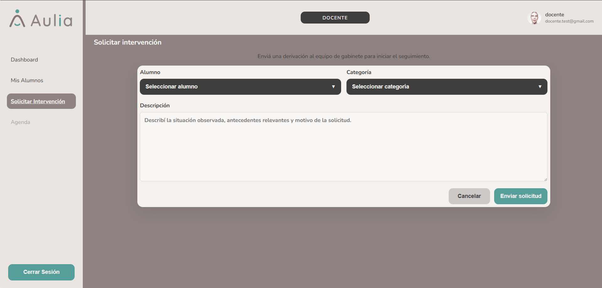

# Docente - Solicitar Intervencion

[Volver a Docente](./index.md) | [Volver al indice](../index.md)

## Crear solicitud

1. Ingresar a **Solicitar intervencion**.
2. Seleccionar el alumno.
3. Seleccionar la categoria.
4. Escribir la descripcion de la situacion observada.
5. Presionar **Enviar solicitud**.

## Crear solicitud desde Mis alumnos

1. Ingresar a **Mis alumnos**.
2. Presionar **Solicitar intervencion** en el alumno correspondiente.
3. Completar categoria y descripcion.
4. Enviar la solicitud.

## Cancelar solicitud

1. Presionar **Cancelar**.
2. El sistema vuelve a la pantalla anterior sin enviar la solicitud.

## Validaciones esperadas

- No permite enviar si falta alumno.
- No permite enviar si falta categoria.
- No permite enviar si falta descripcion.
- Una vez enviada, la solicitud queda registrada y puede verse en el dashboard docente y en la vista Mis alumnos.

Anterior: [Mis alumnos](./mis-alumnos.md)  
Siguiente: [Agenda docente fuera de alcance](./agenda.md)
