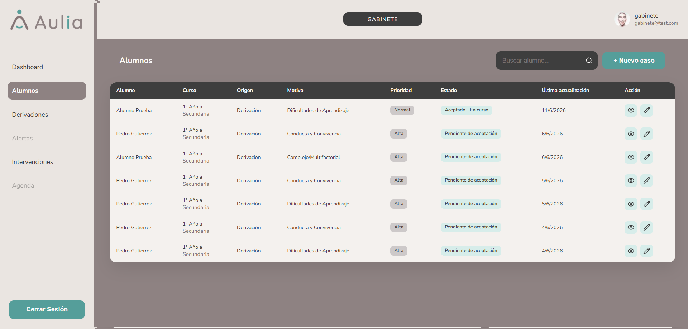
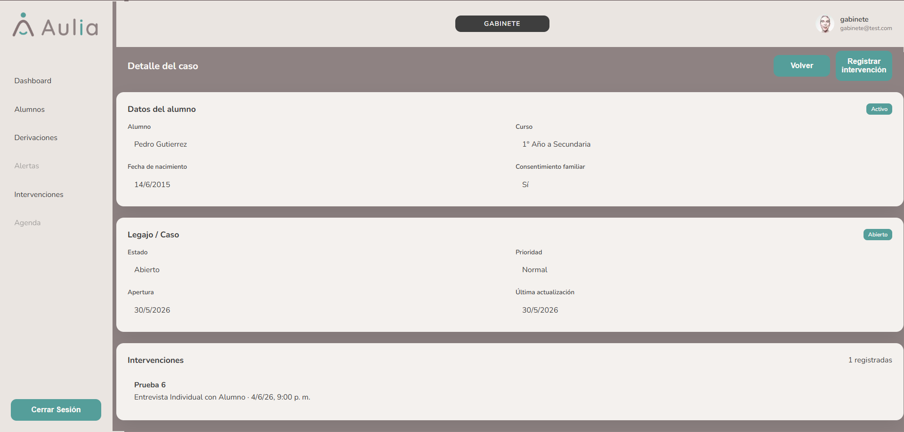

# Gabinete - Alumnos y Casos

[Volver a Gabinete](./index.md) | [Volver al indice](../index.md)

## Consultar alumnos

1. Ingresar a **Alumnos**.
2. Usar el buscador para encontrar un alumno.
3. Revisar si el alumno tiene caso asociado.

## Ver caso

1. En la tabla, presionar **Ver caso**.
2. Revisar datos del alumno, estado del caso e intervenciones relacionadas.
3. Presionar **Volver** para regresar al listado.

## Crear caso desde listado

1. Ingresar a **Alumnos**.
2. Presionar **Nuevo caso**.
3. Seleccionar el alumno.
4. Presionar **Crear caso**.

Los casos creados manualmente quedan registrados como legajos del alumno. La visualizacion en listados puede depender de los filtros o vistas disponibles.

## Crear caso desde detalle

1. Abrir el detalle de un alumno sin caso abierto.
2. Presionar **Crear caso**.
3. El sistema crea el caso y actualiza la pantalla.

## Alumno con caso existente

Si el alumno ya tiene caso, el sistema no debe duplicarlo. Debe mostrar un mensaje y permitir ir al caso existente.

## Crear intervencion desde un caso

1. Abrir el caso del alumno.
2. Presionar **Nueva intervencion**.
3. Completar el formulario de intervencion.

Anterior: [Panel Gabinete](./index.md)  
Siguiente: [Derivaciones](./derivaciones.md)
