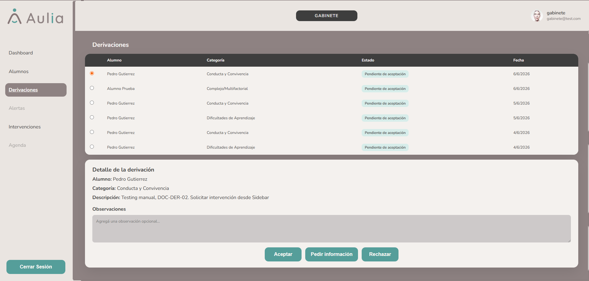

# Gabinete - Derivaciones

[Volver a Gabinete](./index.md) | [Volver al indice](../index.md)

## Consultar derivaciones

1. Ingresar a **Derivaciones**.
2. Revisar la lista de solicitudes recibidas.
3. Seleccionar una derivacion para ver el detalle.

## Aceptar derivacion

1. Seleccionar la derivacion.
2. Revisar el detalle.
3. Agregar notas si corresponde.
4. Presionar **Aceptar**.

## Rechazar derivacion

1. Seleccionar la derivacion.
2. Revisar el detalle.
3. Agregar notas si corresponde.
4. Presionar **Rechazar**.

## Solicitar mas informacion

1. Seleccionar la derivacion.
2. Escribir una nota indicando que informacion falta.
3. Presionar **Solicitar informacion**.

## Validaciones esperadas

- No permite accionar si no hay derivacion seleccionada.
- Actualiza la lista despues de completar una accion.

Anterior: [Alumnos y casos](./alumnos-casos.md)  
Siguiente: [Intervenciones](./intervenciones.md)

