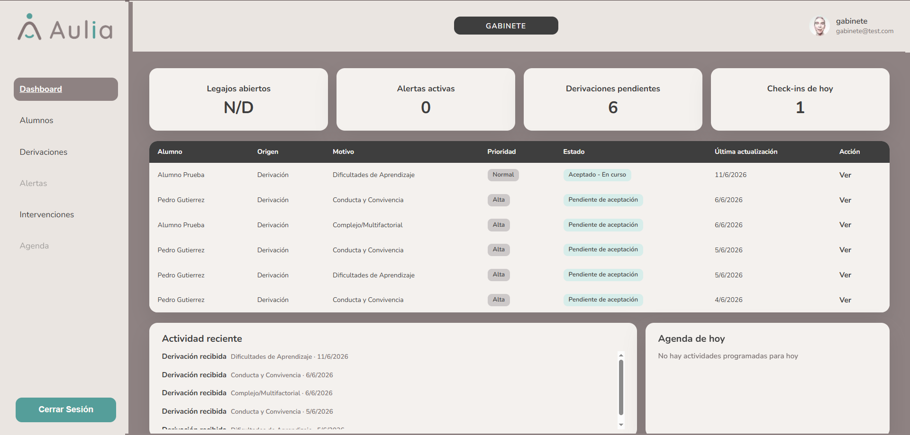

# Panel Gabinete

[Volver al indice](../index.md)

El perfil Gabinete gestiona derivaciones, casos de alumnos e intervenciones.

Agenda y alertas quedan fuera del alcance del MVP actual.

## Flujos disponibles

- [Alumnos y casos](./alumnos-casos.md)
- [Derivaciones](./derivaciones.md)
- [Intervenciones](./intervenciones.md)
- [Agenda y alertas fuera de alcance](./agenda-alertas.md)

## Dashboard

El dashboard muestra metricas y accesos al trabajo operativo del gabinete.

Las metricas disponibles dependen de los datos expuestos por el backend. Si una metrica figura como **N/D** o **-**, significa que el dato no esta disponible en esta etapa.

Anterior: [Agenda docente fuera de alcance](../docente/agenda.md)  
Siguiente: [Alumnos y casos](./alumnos-casos.md)
