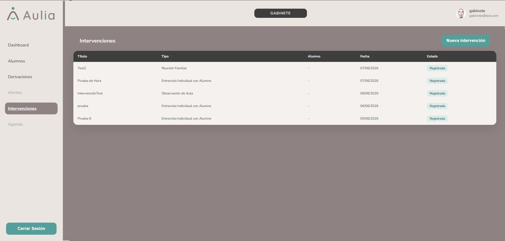
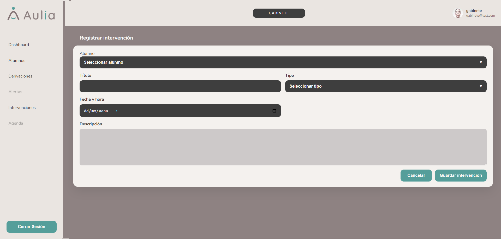

# Gabinete - Intervenciones

[Volver a Gabinete](./index.md) | [Volver al indice](../index.md)

## Listar intervenciones

1. Ingresar a **Intervenciones**.
2. Revisar titulo, tipo, alumno, fecha y estado.

## Registrar nueva intervencion

1. Presionar **Nueva intervencion**.
2. Seleccionar alumno.
3. Completar titulo.
4. Seleccionar tipo.
5. Completar descripcion.
6. Seleccionar fecha.
7. Presionar **Guardar**.

## Registrar intervencion desde un caso

1. Abrir el caso de un alumno.
2. Presionar **Nueva intervencion**.
3. El sistema abre el formulario relacionado al alumno.
4. Completar titulo, tipo, descripcion y fecha.
5. Guardar.

## Alumno sin caso abierto

Si el alumno seleccionado no tiene caso abierto, el sistema informa que no se puede registrar la intervencion hasta crear el caso.

## Cancelar

1. Presionar **Cancelar**.
2. El sistema vuelve a intervenciones o al caso de origen.

Anterior: [Derivaciones](./derivaciones.md)  
Siguiente: [Agenda y alertas fuera de alcance](./agenda-alertas.md)
